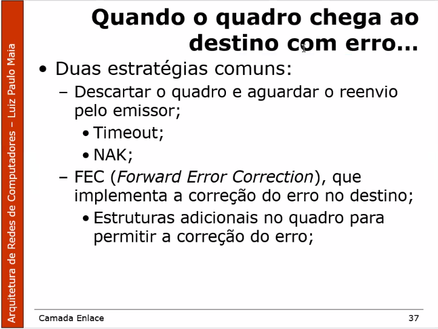
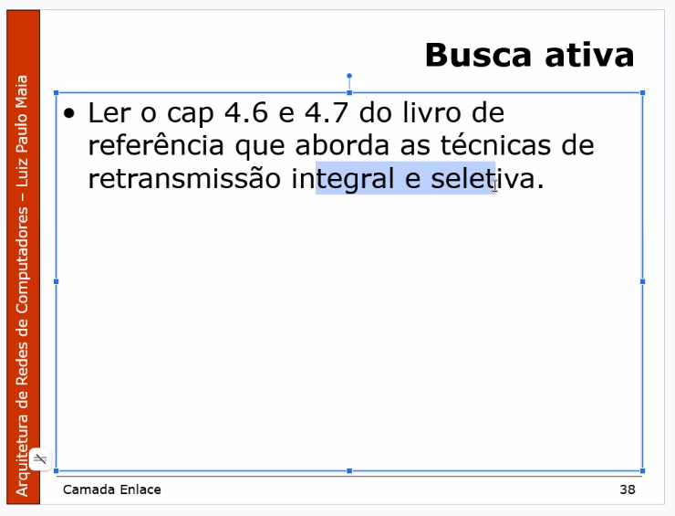

# 11 de Setembro - Camada de Enlace

A Principal função da camada de enlace é **garantir a comunicação entre dispositivos adjacentes**.

Enquanto a camada física trabalha com bits, a camada de enlace trabalha com blocos de bits, chamados **quadros(sinônimo: frames)**.

- Criar e interpretar corretamente os quadros.
- Detectar possíveis erros
- Quando necessário e, possível, corrigi-los

Os quadros são formados por 3 estruturas básicas:
- Cabeçalho
- Dados
- CDE (Código de detecção de erro)
  - que é enviado no final do quadro. Para que quem recebeu o quadro possa verificar se o quadro chegou íntegro.

Embaixo da camada de enlace tem a camada física.

- PDU de rede    == Dados, na camada de enlace
- Cabeçalho      == Origem, destino
- CDE            == Código de detecção de rede

# Enquadramento
**Enquadramento**, ou **Framing** uma função para a necessidade de **identificação** de início/fim de um quadro. Comumente é aplicado o uso de uma flag.
- Flag de início e fim **iguais**
- Flag de início e fim **específicos**

>"Olá. Tem alguém na escuta? **Cambio!**"

1 Byte == 8 Bits

Caso a flag de início/fim ocorresse naturalmente dentro do quadro, o receptor poderia entender erroneamente que o quadro havia chego ao fim.

A solução para esse problema é o **Byte Stuffing** e **Bit Stuffing**.

> "Olá. Estou saindo. Preciso comprar um **Câmbio** ~~para o meu caminhão. **Cambio!**~~"

Sempre que houver uma sequencia igual à tag de inicio/fim, é acrescentado um Byte que identifica que o valor é igual a flag.

> "Olá. Estou saindo. Preciso comprar um *IGNORA* **Câmbio** para o meu caminhão. **Cambio!**"

Sempre que houver uma sequencia igual à tag de inicio/final, é acrescentado um bit que identifica que o valor é igual a flag.

---
# Endereçamento
O endereçamento na camada de enlace está associado à identificação da **interface de comunicação**, que conecta o dispositivo à rede(*Placa de rede/Hardware*).

Cada interface possui um endereço **único** que permite identificá-la.

O formato é definido pelo protocolo de enlace e deve ser seguido pelos fabricantes de interfaces de redes.

Esse endereço também é chamado de **endereço físico** ou **endereço MAC** (*Media Access Control*)

---
## Quadro Ethernet

Existem 3 Formas de endereçamento

- Unicast (1 computador para 1 computador 1:1)
- Multicast (1:varios)
- Broadcast (1:todos)

# Detecção de erros
Qualquer transmissão está sujeita a problemas, como ruídos e atenuação. Cabe a **camada de enlace** identificar e tratar esses erros.

## Noção Intuitiva
Vamos usar por exemplo o dígito verificador de conta bancária:
- c/c 05652-5

O *5* é um valor gerado a partir dos demais números através de uma função matemática.  
O CPF segue a mesma linha.

A Detecção de erros é feita pelas informações de controle que são enviadas juntamente com os dados transmitidos.

A função serve para calcular o **CDE** a partir da mensagem a ser enviada. Gerando uma espécie de dígito verificador, como no exemplo acima.
 
## Bit de Paridade
A técnica mais utilizada para a detecção de erros em transmissões orientadas a caractere é conhecida como **bit de paridade**.

### Paridade Simples
Consiste em adicionar um bit ao final de cada caractere transmitido, de modo que, com esse bit, o total de bits 1 seja par (Paridade PAR) ou ímpar (Paridade ímpar)

- É simples e rápido.
- Limitado a identificação de 1 bit
- Indicada para comunicações de baixa velocidade e com erros esporádicos. 

### Paridade Múltipla

[How to send a self-correcting message (Hamming codes)](https://www.youtube.com/watch?v=X8jsijhllIA&ab_channel=3Blue1Brown)

D = Polinômio gerador. É uma constante já definida.

ACK == acknowledge (Confirmação).  OK, tudo certo

NAK == negative acknowledgment ou not acknowledged

