# Programação de Soluções Computacionais 
> Professor: Adalberto Gassenferth Junior  
> 19 de Fevereiro de 2024

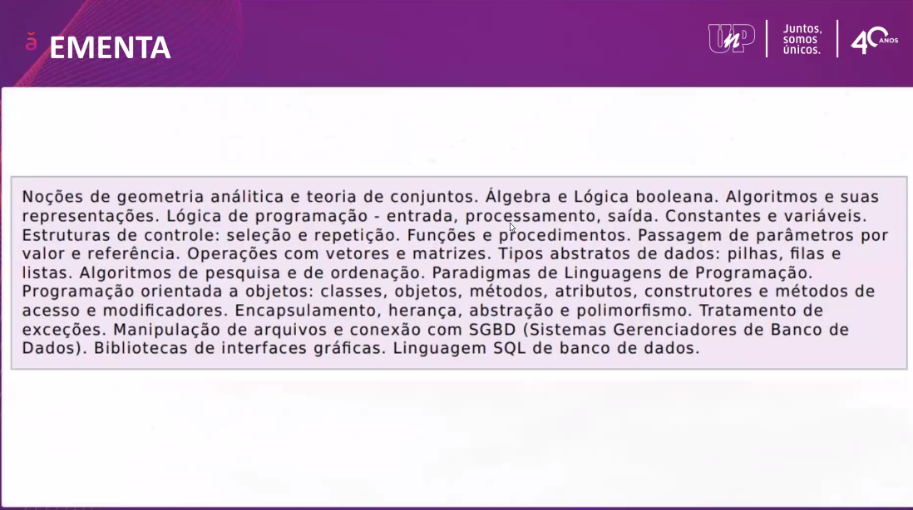

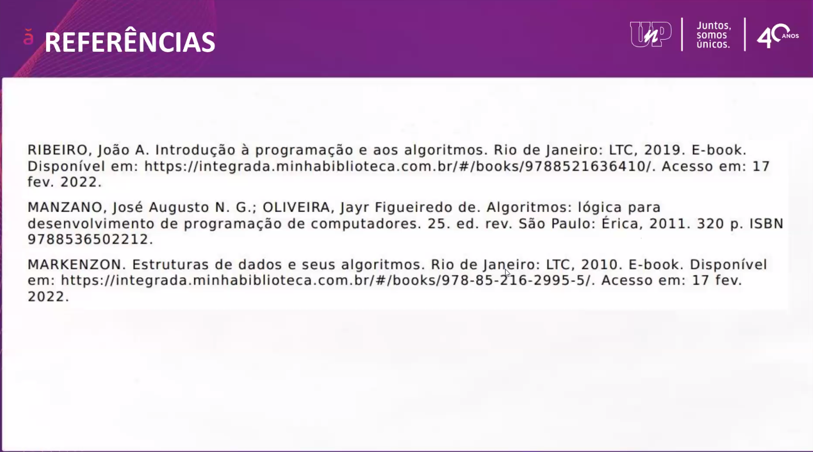

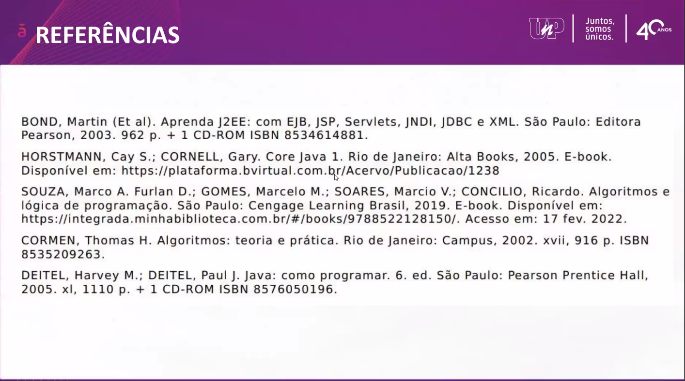

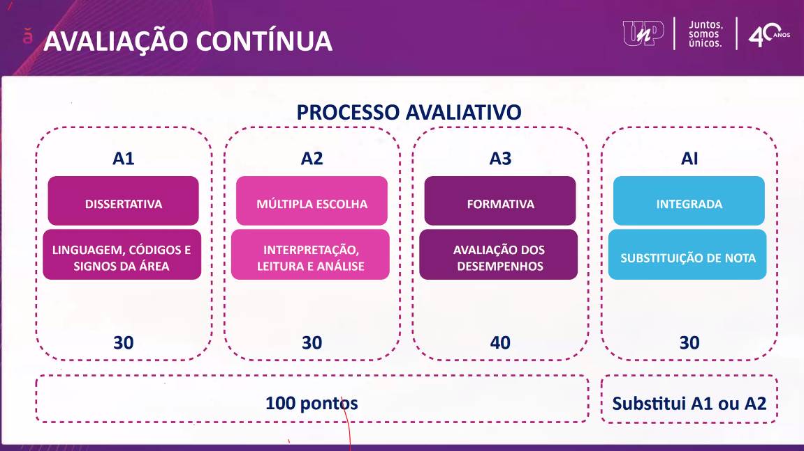

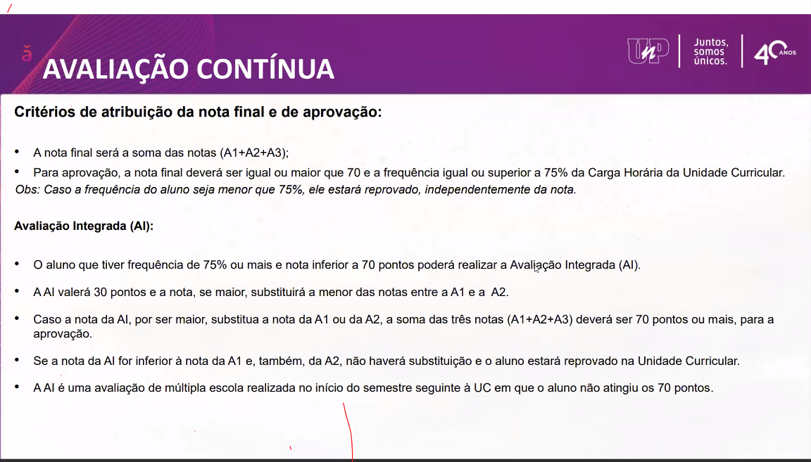

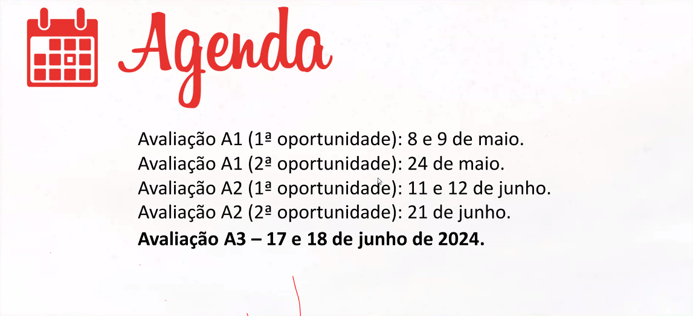

[Bibliotecas ULIFE](social.ulife.com.br)

[JavaPoint](https://www.javatpoint.com/)

---
---

## O que são Algoritmos
"Um algoritmo é uma sequencia de passos que visa atingir um objetivo bem definido, resolvendo um problema".

### Passos a se seguir ao criar um algoritmo

1. Compreender completamente o problema a ser resolvido
2. Quais dados serão fornecidos e quais objetos fazem parte desse cenário problema
3. Definir o processamento (dados de entrada -> dados de saída)
4. Quais dados serão gerados depois do processamento
5. Construir o algoritmo utilizando um dos tipos (Fluxograma, Descrição Narrativa ou Pseudocódigo)
6. Testar o algoritmo realizando simulações.

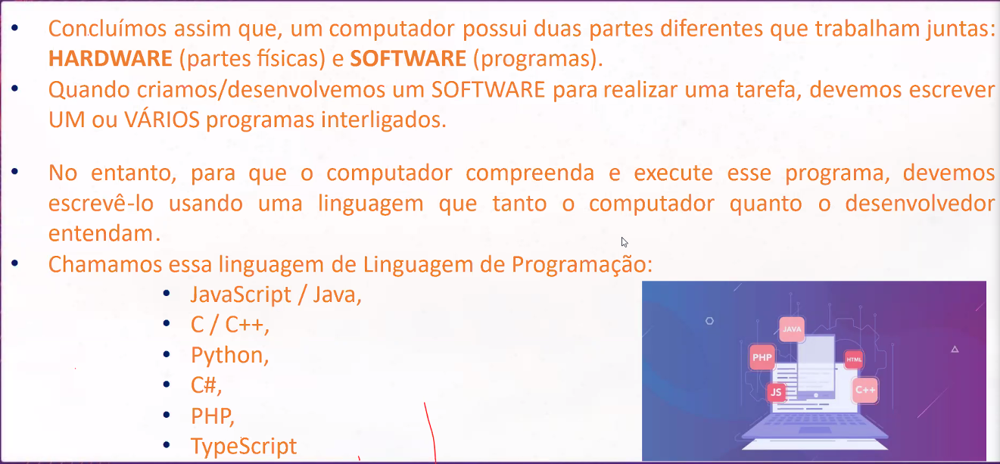

[What most schools don't teach - dublado](https://www.youtube.com/watch?v=4iKu9qtCSXg&ab_channel=MarcoLangoni)

Etapas para do des. de um programa

- Análise
- Algoritmo
- Codificação

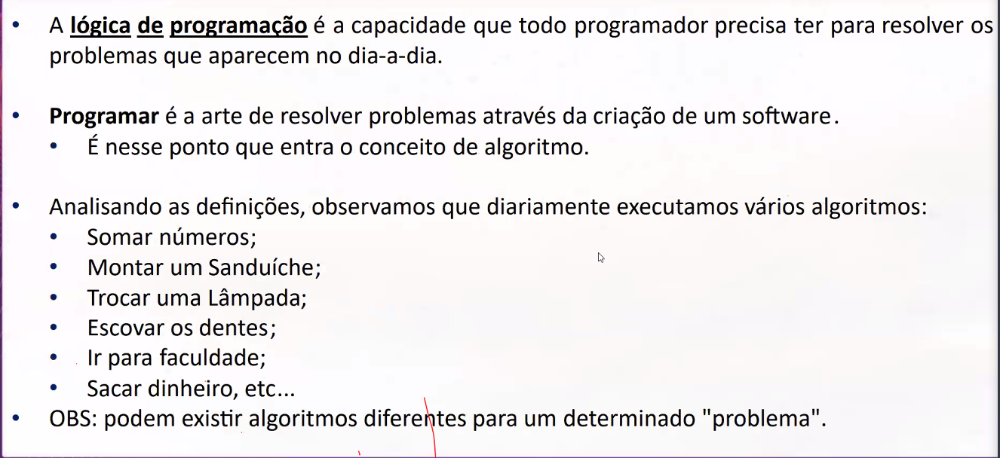

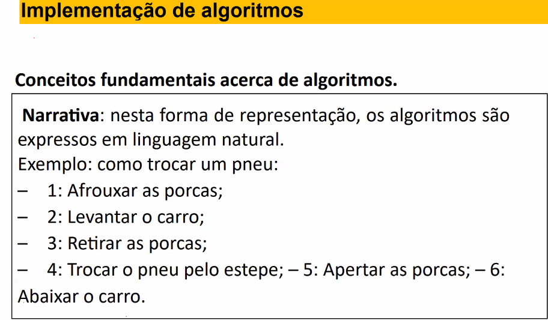

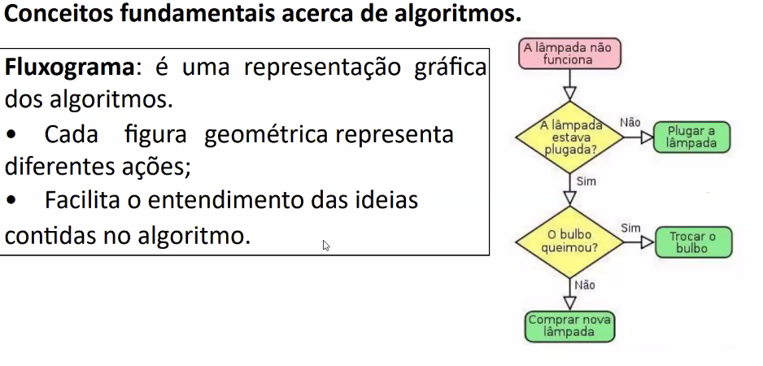

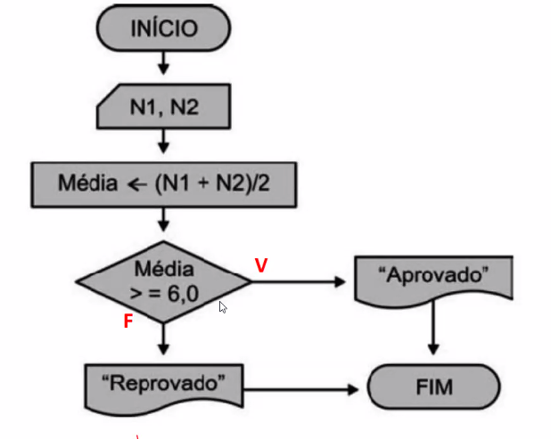

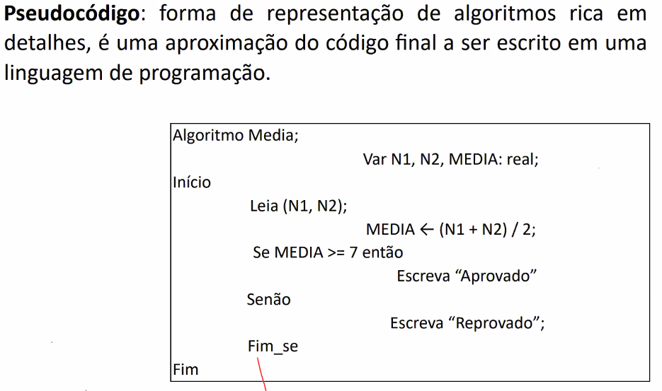

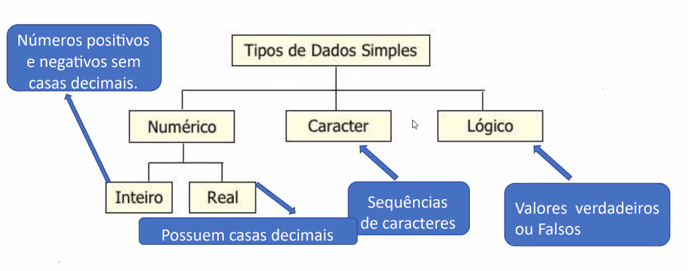

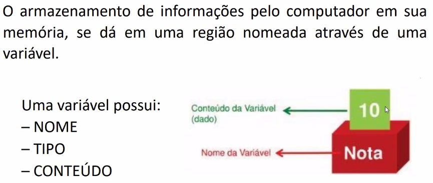

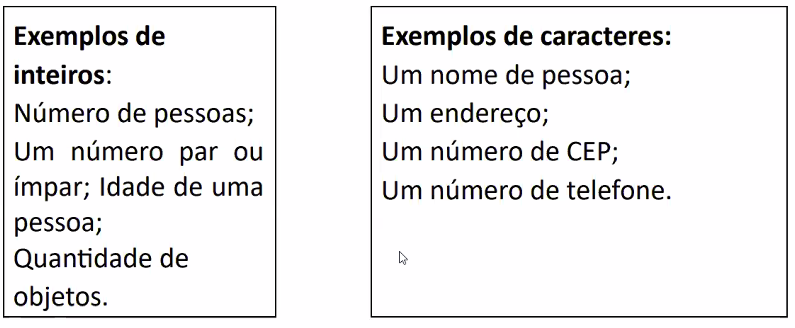

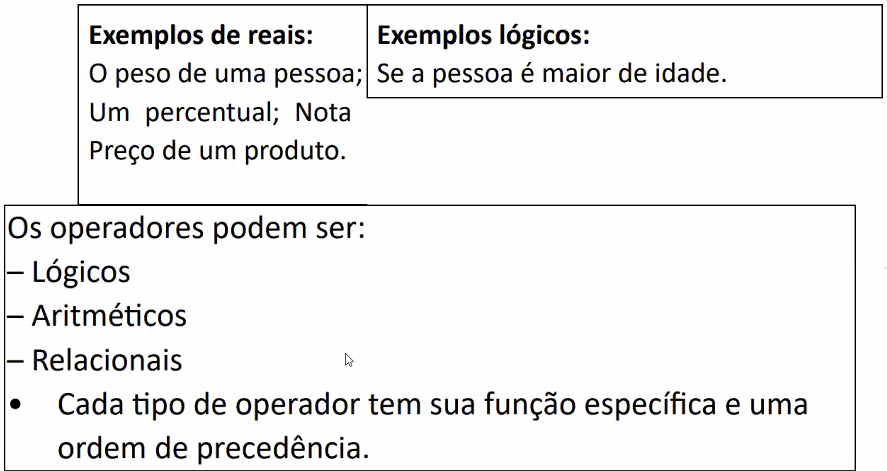

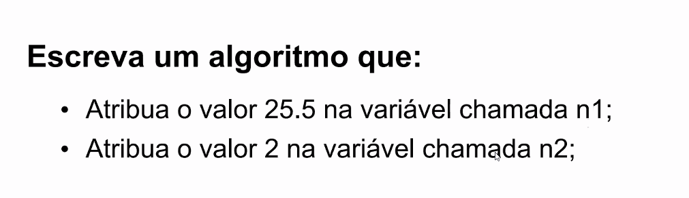
+ Imprimir e mostrar a soma das duas variaveis