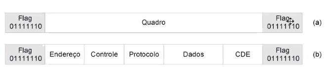
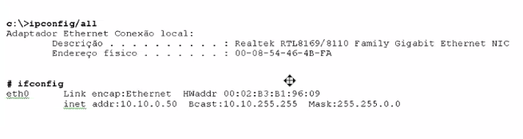
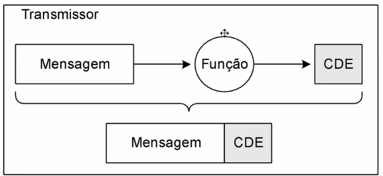
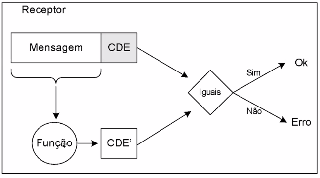
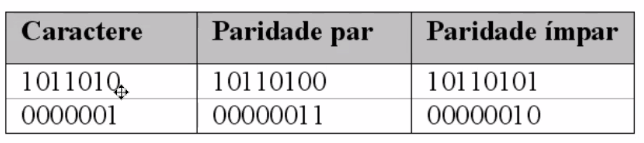
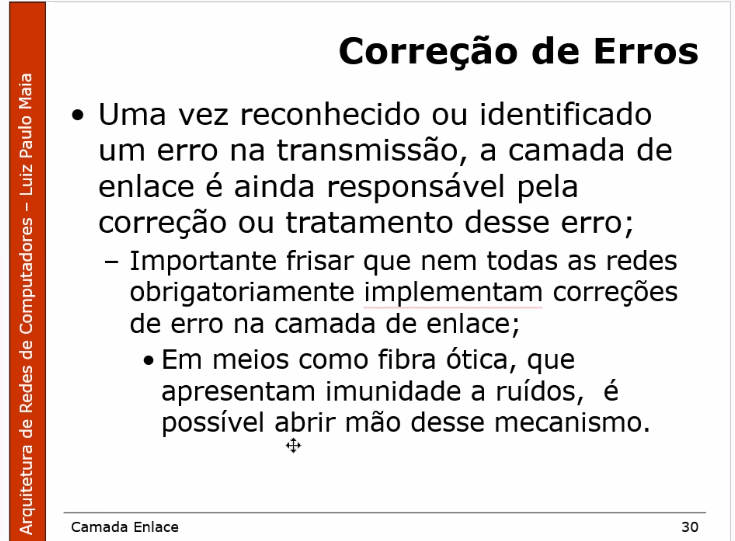

## 11 de Setembro - Camada de Enlace

Quadros == Frames

Os quadros são formados por 3 estruturas básicas:
- Cabeçalho
- Dados
- CDE (Código de detecção de erro)
  - Código que é enviado no final do quadro. Para que quem recebeu o quadro possa verificar se o quadro chegou íntegro.

Representação visual.
Embaixo da camada de enlace tem a camada física.

- PDU de rede == Dados, na camada de enlace
- Cabeçalho == Origem, destino
- CDE = Código de detecção de rede

A camada de enlace é responsável por construir a estrutura, antes de enviar os dados pela camada física.

Enquadramento == Framing

- "Olá. Tem alguém na escuta? **Cambio!**"

1 Byte == 8 Bits

Sempre que houver uma sequencia igual à tag de inicio/final, é acrescentado um Byte que identifica que o valor é igual a flag.

Sempre que houver uma sequencia igual à tag de inicio/final, é acrescentado um bit que identifica que o valor é igual a flag.

Interface de comunicação == Placa de rede(Hardware).

Esse endereço é único para cada dispositivo e padronizado mundialmente

- Unicast (1 computador para 1 computador 1:1)
- Multicast (1:varios)
- Broadcast (1:todos)

O CDE serve para ser esse dígito verificador. 

[How to send a self-correcting message (Hamming codes)](https://www.youtube.com/watch?v=X8jsijhllIA&ab_channel=3Blue1Brown)

D = Polinômio gerador. É uma constante já definida.

ACK == acknowledge (Confirmação).  OK, tudo certo

NAK == negative acknowledgment ou not acknowledged

