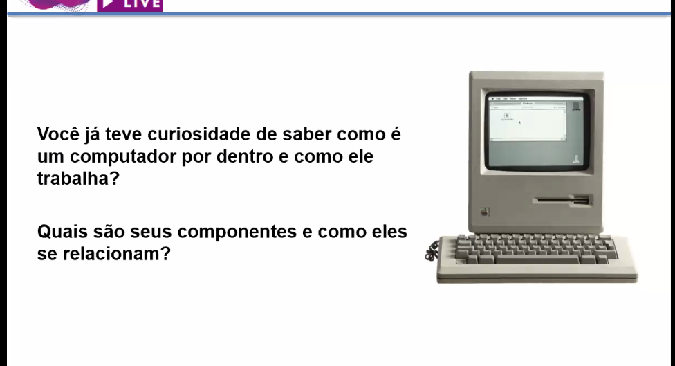

# 14 Setembro

## Conceitos Básicos

https://web.fe.up.pt/~ee96100/projecto/Tabela%20ascii.htm

A = Alt + 65

## Sistemas Operacionais
- DOS
- Linux
- Unix (Mainframe)
- Android

[Simulador](https://bellard.org/jslinux/)

## Linguagem de programação de aplicativos

